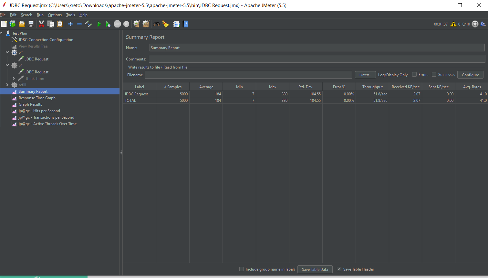

# load_db
<h1 align="center">Домашнее задание к лекции 4 «Проведение нагрузочного тестирования DB» </h1>

### Summary report  процедуры dorepeat_v1 при 10 потоках и 500 обращений

### Summary report  процедуры dorepeat_v2 при 10 потоках и 500 обращений

1. Максимальное время отклика при таких настройках jmeter у второй процедуры больше в 8,78 раз
2. Пропускная способность у dorepeat_v2 d 14.7 раз хуже.

### Вывод 
Все логично.
